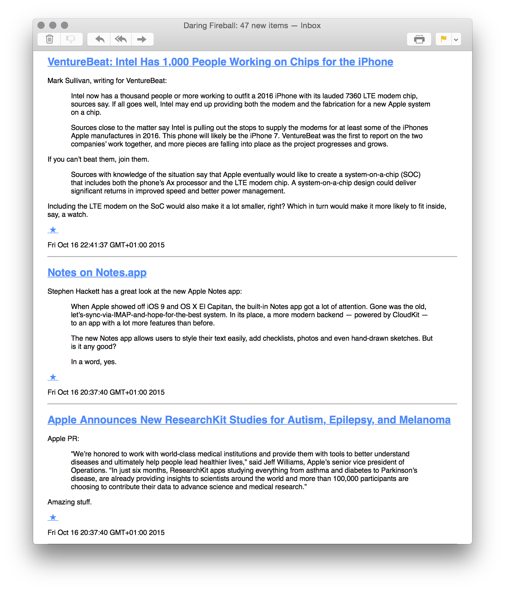

# feedletter

Send Atom or RSS feed updates via HTML email (one per feed per execution).

## Usage

### Configure

Create file `config.edn`

    {
     :from "feedletter@example.org"
     :to "me@example.org"
     :smtp {:host "example.org"
            :user "username"
            :pass "password"
            :ssl true}
     :feeds ["http://www.xkcd.com/atom.xml"
             "http://bldgblog.blogspot.ch/atom.xml"
             "http://bits.blogs.nytimes.com/feed/"
             "http://daringfireball.net/feeds/main"]
     }

### Run

    java -jar feedletter.jar

### Reset

    rm -rf .state
    
### Screenshot

